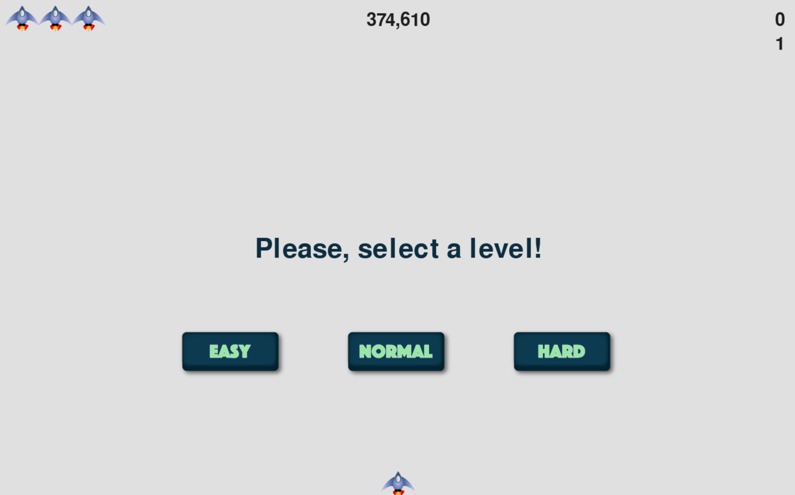
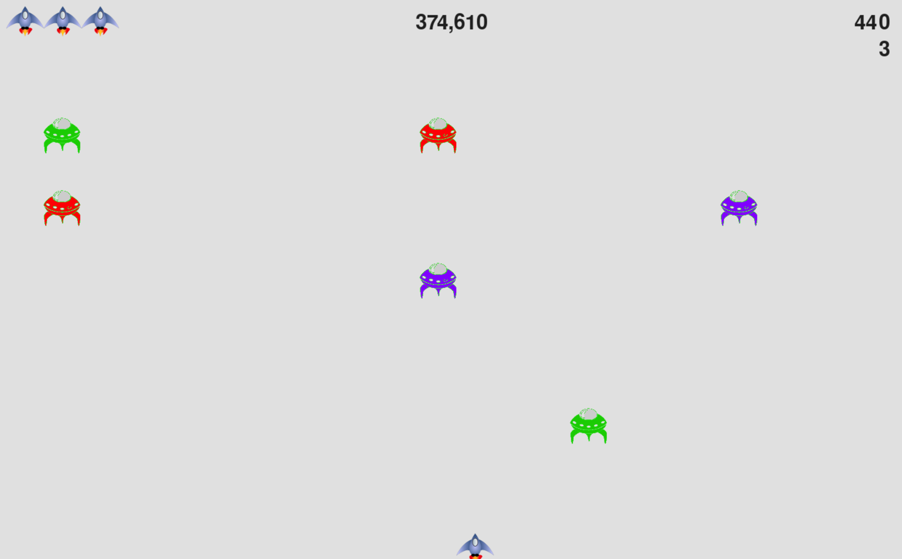

# Alien Invation

This is a project of [Python Crash Course, Second Edition](http://www.nostarch.com/pythoncrashcourse/), an introductory programming book.

## Table of contents

- [Overview](#overview)
  - [The project](#the-project)
  - [Screenshot](#screenshot)
- [Usage](#usage)
- [My process](#my-process)
  - [Built with](#built-with)
  - [What I learn](#what-i-learn)
- [Author](#author)

## Overview

### The project

This game has two main component:

- A rocket ship that moves right and left and fires bullets in response to player input.
- A fleet of aliens to destroy.

### Screenshot

## Usage
To play this game you should clone this repository and run alien_invation.py file

## My process

### Built with

- pygame
- Pygame.font
- pygame.mixer

### What I learn

-pygame
-Manage a large project.
-How to organize the code.

## Author

- Linkedin - [Tomas Agustin Mansilla](https://www.linkedin.com/in/tomasamansilla/)

